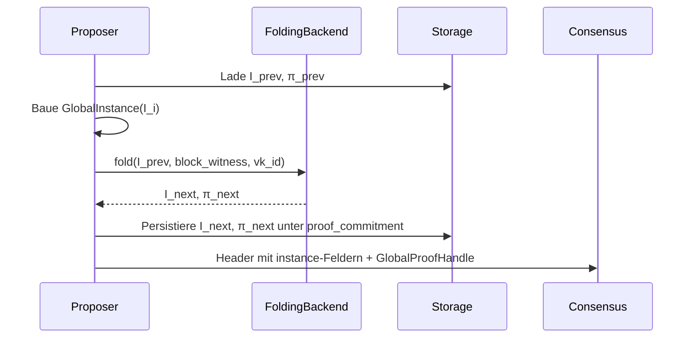
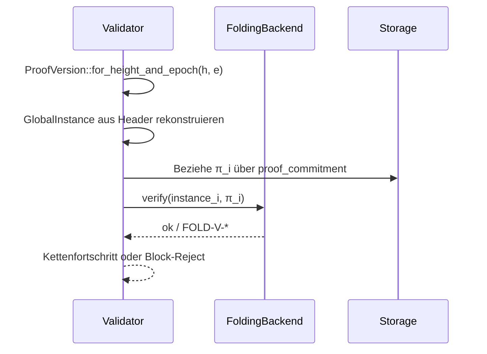

# Folding-gestützter Blocklebenszyklus

Dieser Leitfaden beschreibt die praktische Nutzung von `GlobalInstance`, `GlobalProof` und `FoldingBackend` für Proposer und Validatoren. Zusätzlich dokumentiert er den Übergang von `AggregatedV1` zu `NovaV2` und zeigt Sequenzen des neuen Blocklebenszyklus mit Folding.

## Komponentenüberblick
- **GlobalInstance** kapselt die öffentlichen Inputs eines Faltungs-Schritts (Blockhöhe, State-/RPP-/Pruning-/History-Commitments) und erzeugt eine deterministische Gesamt-Commitment-Kette über `from_commitments` bzw. `from_state_and_rpp`.【F:rpp/zk/backend-interface/src/folding.rs†L64-L118】【F:rpp/zk/backend-interface/src/folding.rs†L140-L184】
- **GlobalProof** ist der gefaltete Beweis für den Schritt *i → i+1* und wird zusammen mit `GlobalInstance` vom Backend erzeugt und in Storage abgelegt (Handle im Header, Voll-Beweis per Content Addressing).【F:rpp/runtime/types/block.rs†L365-L374】【F:rpp/zk/backend-interface/src/folding.rs†L413-L454】
- **FoldingBackend** definiert `fold` und `verify`, um einen neuen Schritt zu erzeugen bzw. einen Handle/Beweis gegen `GlobalInstance` zu prüfen. Validatoren rufen den Verifikationspfad auf, Proposer den Faltungs-Pfad.【F:rpp/zk/backend-interface/src/folding.rs†L338-L372】【F:rpp/zk/backend-interface/src/folding.rs†L647-L686】
- **ProofVersion** legt fest, ob ein Header `AggregatedV1` (alt) oder `NovaV2` (neuer Folding-Stack) erwartet und erzwingt einen Cutover bei Höhe `1_500_000` oder Epoche `300`.【F:rpp/zk/backend-interface/src/proof_version.rs†L8-L34】

## Schritt-für-Schritt: Proposer
1. **Instanz aufbauen**: Kombiniere die State-/RPP-/Pruning-/History-Commitments des aktuellen Blocks mit der Blockhöhe zu einer `GlobalInstance` über `from_commitments` oder `from_state_and_rpp`. Damit entsteht die deterministische Kombi-Commitment-Kette, die später im Header gespiegelt wird.【F:rpp/zk/backend-interface/src/folding.rs†L140-L184】
2. **Vorherige Instanz laden**: Hole `I_prev` und optional `π_prev` (letzter GlobalProof) aus Storage, sodass der Faltungs-Schritt die Kette fortsetzen kann.【F:rpp/storage/mod.rs†L465-L536】
3. **Faltungs-Schritt ausführen**: Rufe `FoldingBackend::fold(instance_prev, block_witness, vk_id)` auf. Das Backend prüft Index-Kohärenz (`FOLD-STEP-001`–`011`), baut die neue Instanz `I_next` und erzeugt `π_next`.【F:rpp/zk/backend-interface/src/folding.rs†L404-L454】
4. **Handle veröffentlichen**: Schreibe `GlobalProofHandle` (Commitment, `vk_id`, `ProofVersion`) und `GlobalInstance::to_header_fields()` in den Block-Header. Der Voll-Beweis wird unter dem Proof-Commitment in Storage abgelegt und optional per Gossip bereitgestellt.【F:rpp/runtime/types/block.rs†L365-L374】【F:rpp/zk/backend-interface/src/folding.rs†L87-L118】
5. **Persistieren**: Speichere `I_next` + `π_next` in der Kette, damit der nächste Block deterministisch anknüpft.【F:rpp/storage/mod.rs†L532-L553】

## Schritt-für-Schritt: Validator
1. **Version auswählen**: Bestimme über `ProofVersion::for_height_and_epoch` die erwartete Pipeline (`AggregatedV1` vor Cutover, `NovaV2` ab Cutover). Damit wird klar, ob ein Folding-Proof-Handle vorhanden sein muss.【F:rpp/zk/backend-interface/src/proof_version.rs†L20-L34】
2. **Header extrahieren**: Lese `GlobalInstance`-Felder aus dem Header und rekonstruiere die Instanz-Kombination, sodass der nachfolgende Verifikationsschritt dieselben öffentlichen Inputs sieht wie der Prover.【F:rpp/runtime/types/block.rs†L365-L374】
3. **Proof beziehen**: Lade den Voll-Beweis aus Storage oder über Content Addressing (`proof_commitment` aus dem Handle). Fehlende Blobs führen zu `FOLD-V-010` und schlagen den Block fehl.【F:rpp/zk/backend-interface/src/folding.rs†L416-L454】
4. **Verifizieren**: Rufe `FoldingBackend::verify(&instance, &proof)` auf. Validatoren prüfen den Index-Fortschritt und die Kombi-Commitments; abweichende VK-IDs oder Versionen werden als `FOLD-V-005`/`FOLD-V-006` geloggt.【F:rpp/zk/backend-interface/src/folding.rs†L647-L686】【F:rpp/runtime/types/block.rs†L459-L544】
5. **Resultat spiegeln**: Bei Erfolg wird die Instanz als neue Ketten-Spitze übernommen und für den nächsten Block als `I_prev` bereitgestellt; bei Fehlern wird der Block verworfen und Telemetrie erhält den entsprechenden `FOLD-V-*` Code.【F:rpp/storage/mod.rs†L501-L553】

## Übergang von `AggregatedV1` zu `NovaV2`
- **Cutover-Logik**: `ProofVersion::for_height_and_epoch` wählt ab Höhe `1_500_000` oder Epoche `300` automatisch `NovaV2`; darunter bleibt `AggregatedV1` zulässig. Tests dürfen Cutover-Werte via `configure_cutover` überschreiben.【F:rpp/zk/backend-interface/src/proof_version.rs†L10-L37】
- **Bootstrap von `I_boot`/`π_boot`**: Beim Nova-Cut wird ein signierter Snapshot oder der aktuelle Head in eine initiale `GlobalInstance` (`I_boot`) und den zugehörigen Beweis (`π_boot`) übersetzt und persistent abgelegt, sodass der erste Nova-Block deterministisch aufsetzt.【F:rpp/storage/mod.rs†L532-L553】【F:rpp/zk/backend-interface/src/folding.rs†L413-L454】
- **Umschaltpunkt im Header**: Proposer schreiben ab dem Cutover `ProofVersion::NovaV2` in jeden Header; Validatoren lehnen mismatches strikt ab. Das garantiert, dass Altketten mit `AggregatedV1` nach Rollback weiter gültig bleiben, während Finalität nach dem Cut nur mit Nova-Beweisen erreicht werden kann.【F:rpp/runtime/types/block.rs†L365-L374】【F:rpp/zk/backend-interface/src/proof_version.rs†L20-L34】

## Diagramme

### Sequenz: Proposer-Faltung eines Blocks


### Sequenz: Validator-Verifikation


### Block-Lebenszyklus mit Folding
```mermaid
graph TD
    A[Block i erzeugen] --> B[GlobalInstance aus Header-Commitments ableiten]
    B --> C[FoldingBackend::fold(I_{i-1}, witness_i)]
    C --> D[GlobalProofHandle in Header schreiben]
    D --> E[Persistiere I_i + π_i]
    E --> F{Cutover erreicht?}
    F -- Ja (NovaV2) --> G[Validator nutzt FoldingBackend::verify]
    F -- Nein (AggregatedV1) --> H[Validator nutzt Aggregation-Verify]
    G --> I[Finalisiere Block i]
    H --> I
    I --> J[Nächster Block verwendet I_i als I_{i-1}]
```
